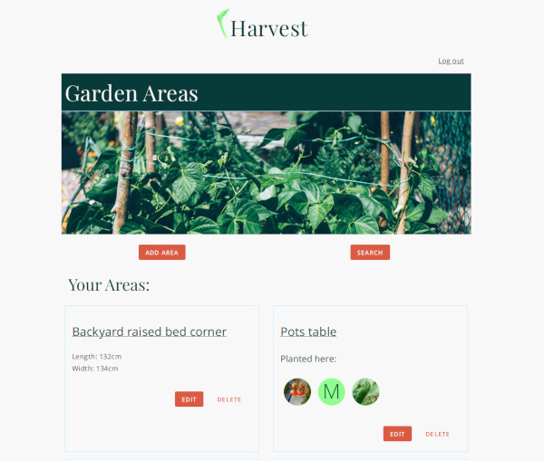
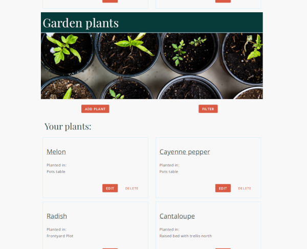

# 'Harvest-api'

[Live App](https://harvest-psi.vercel.app/).

## Description

'Harvest' is a tool to help users keep track of their garden's progress. The user can organize their garden by areas and save information about their plants with the option to look for plant data using an external API (trefle.io) or fill the plant's data themselves. The users can also save notes related to their garden or a specific plant or area.

'Harvest-api' is the server-side of the application. It is set-up to store and serve users, garden, areas, plants, and notes data.

## Further goals for this project

I would like to use the plant's data in useful ways like letting the user know when to expect their crops to be ready or how to distribute the space in their garden areas taking into account the plants' spread and growth

## Summary

The server-side application offers CRUD functions for authentication, user creation, and garden related data.

## Built with

This project was made with Express, Knex and Postgresql.

## Client side repo:

[Harvest-api](https://github.com/wayfaringjou/harvest)

## API documentation

### Authentication

To use this API's endpoints a user with a valid username and password must be created and sign in to get a token for requests.

### Resources in the REST API

#### Users

User creation and authentication.

#### Gardens

Representation of a user's garden.

#### Garden Areas

Representation of areas in a garden.

#### Plants

Plants data with basic information about it's appearance and care needed.

#### Notes

Notes that can be related with areas or plants to log needed care or details.

### Endpoints available

All endpoints require `Authorization: Bearer {api-token}` included in the request's header.
The token is provided by the api when a user logs in.

#### /auth

##### Actions

- `POST /auth`

  - Response:

    - New user data including garden data created by default.

  - Parameters

    | name      |  type  |  in  | description                      |
    | :-------- | :----: | :--: | :------------------------------- |
    | user_name | string | body | (Required) Username for new user |
    | password  | string | body | (Required) Password for new user |

- `POST /auth/login`

  - Response:

    - JWT encoded authorization token.

  - Parameters

    | name      |  type  |  in  | description                      |
    | :-------- | :----: | :--: | :------------------------------- |
    | user_name | string | body | (Required) Username for new user |
    | password  | string | body | (Required) Password for new user |

#### /api/users/{user-id}

##### Actions

- `GET /api/users/{user-id}/gardens`

  - Response:
    - List of user's gardens (Every user has a garden created by default).

- `POST /api/users/{user-id}/gardens`

  - Create a new template object.

  - Parameters

    | name    |  type   |  in  | description                            |
    | :------ | :-----: | :--: | :------------------------------------- |
    | user_id | integer | body | (Required) Id of user that owns garden |
    | name    | string  | body | (Required) Name for garden             |

- `GET /api/users/{user-id}/gardens/{garden-id}`

  - Response:
    - Garden object with corresponding {garden-id}.

- `GET /api/users/{user-id}/garden/notes`

  - Response:
    - Notes created by {user-id}.

- `GET /api/users/{user-id}/garden/notes/{note-id}`

  - Response:
    - Single note created by {user-id} and with id equal to {note-id}.

- `POST /api/users/{user-id}/garden/notes`

  - Create a new note object.

  - Parameters

    | name      |  type   |  in  | description                                  |
    | :-------- | :-----: | :--: | :------------------------------------------- |
    | user_id   | integer | body | (Required) Id of user that owns note         |
    | garden_id | integer | body | (Required) Id of garden this note relates to |
    | area_id   | integer | body | (Optional) Id of area this note relates to   |
    | plant_id  | integer | body | (Optional) Id of plant this note relates to  |
    | title     | string  | body | (Required) Title for note                    |
    | content   | string  | body | (Required) Content for note                  |

#### /api/gardens/{garden-id}

##### Actions

- `GET /api/gardens/{garden-id}/areas`

  - Response:
    - List of all areas for a garden.

- `GET /api/gardens/{garden-id}/areas/{area-id}`

  - Response:
    - Single area object with id equal to {area-id}.

- `GET /api/gardens/{garden-id}/plants`

  - Response:
    - List of all plants for a garden.

- `GET /api/gardens/{garden-id}/plants/{plant-id}`

  - Response:
    - Single plant object with id equal to {plant-id}.

- `POST /api/gardens/{garden-id}/plants`

  - Create a new note object.

  - Parameters

    | name            |  type   |  in  | description                                                 |
    | :-------------- | :-----: | :--: | :---------------------------------------------------------- |
    | name            | string  | body | (Required) Name for plant                                   |
    | garden_id       | integer | body | (Required) Id of garden this plant relates to               |
    | area_id         | integer | body | (Optional) Id of area this plant relates to                 |
    | image_url       | string  | body | (Optional) Url for an image of the plant                    |
    | scientfic_name  | string  | body | (Optional) Plant's scientific name                          |
    | sowing          | string  | body | (Optional) Sowing description for plant                     |
    | light           | integer | body | (Optional) Value from 0 to 10 for the light needed by plant |
    | days_to_harvest | integer | body | (Optional) Average days to harvest                          |
    | row_spacing     | integer | body | (Optional) Recommended spacing between sowed seeds in cm    |
    | spread          | integer | body | (Optional) Average spread of the plant in cm                |
    | fruit_months    | string  | body | (Optional) Months when plant ususally bears fruit           |
    | images          |  json   | body | (Optional) {'part of plant': [image_url: "url"]}            |
    | trefelpath      | string  | body | (Optional) Path for plant in trefle.io API                  |
    | gbifspecieskey  | integer | body | (Optional) Identifier for plant in gbif API                 |

- `POST /api/gardens/{garden-id}/areas`

  - Create a new note object.

  - Parameters

    | name      |  type   |  in  | description                                  |
    | :-------- | :-----: | :--: | :------------------------------------------- |
    | garden_id | integer | body | (Required) Id of garden this area relates to |
    | length_cm | integer | body | (Optional) Length of area                    |
    | width_cm  | integer | body | (Optional) Width of area                     |
    | name      | string  | body | (Required) Name for area                     |

#### /api/areas

##### Actions

- `GET /api/areas/{area-id}`

  - Response:
    - Single area object for the given id.

#### /api/plants

##### Actions

- `GET /api/plants/{plant-id}`

  - Response:
    - Single plant object for the given id.

## Client screenshots
- Landing page

 

- Garden areas section

 

- Plants section

 

- Plant detail

 

## Client Summary
The client-side application combines our API with an external API to help the user gather data about their plants and shows images that can help identify plant species. It also allows the user to manage notes and areas.

## Client Built with
This project was made with React, Javascript and CSS.
